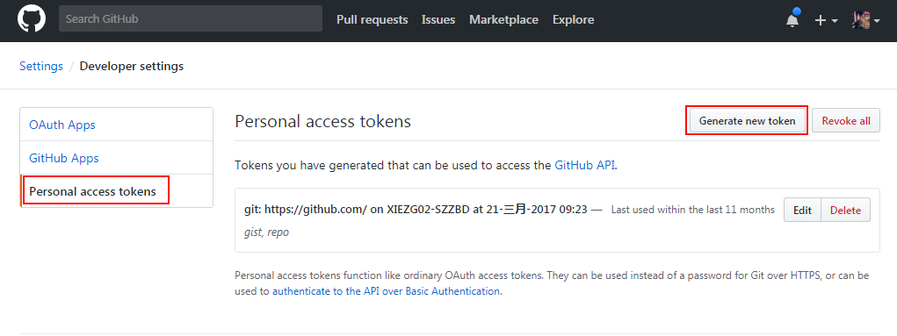
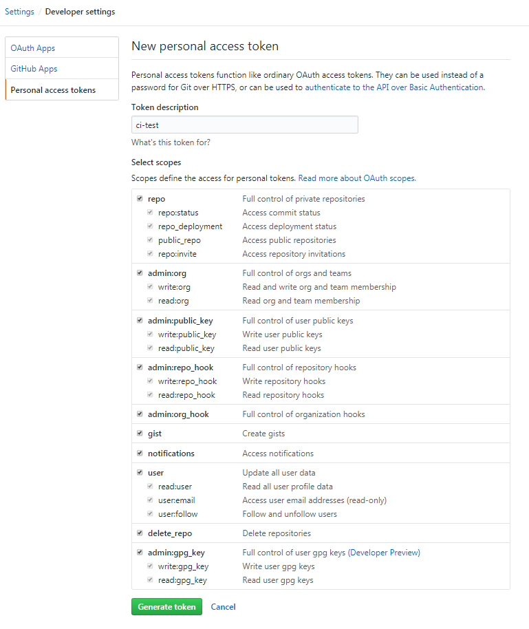
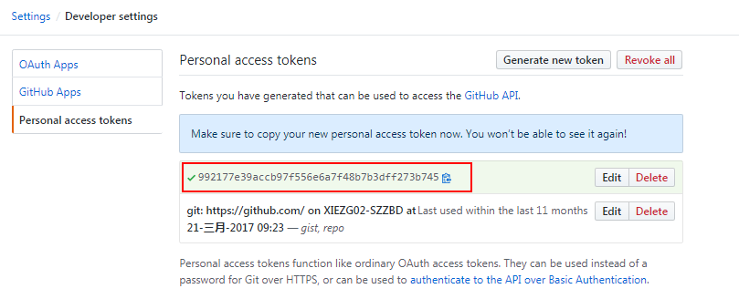
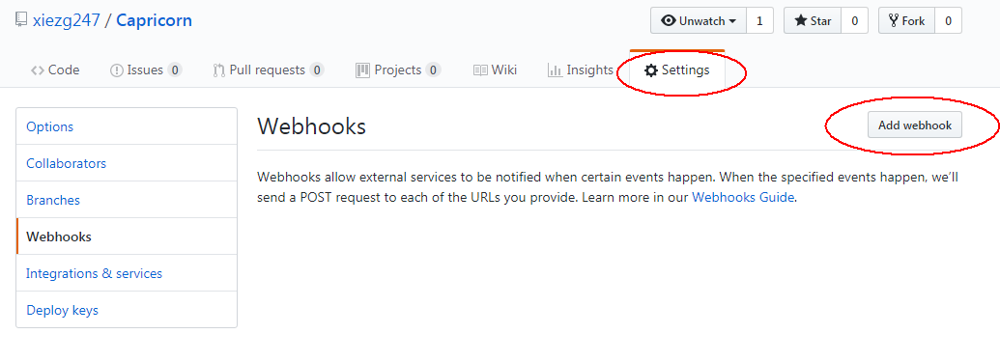

## 一. 背景
自动化部署就是为了解放生产力。

## 二. CI部署
### Jenkins与Github集成

#### Github Hooks
配置Github项目仓库，Github项目仓库在处理这些动作的同时会发送信号至Jenkins触发自动构建操作。

##### 生成Personal Access Token
- 登录[Github](https://github.com)，在头像上点击settings

- 点击Developer settings下的Personal access tokens

- 点击Generate new token,在Token description中填一个描述名称，下面的复选框是这个token需要的权限，按照需要的权限勾上。

- token可复制使用


##### 配置Github项目仓库
上面的Token是属于账户级的东西，Webhooks是项目级别的。当项目发生了某个事件，Github会给一个指定的url发Post请求。
- 点击项目仓库的settings

- 在Webhooks选项卡中，点击Add webhook

- 将在Jenkins生成的Hook URL填入至Payload URL中，选择自主事件,当Github收到了客户端有Push/Pull Request动作时，会触发一个Hook

- 保存WebHook


#### Jenkins安装
- [Installing Jenkins on Ubuntu](https://wiki.jenkins.io/display/JENKINS/Installing+Jenkins+on+Ubuntu)

#### Jenkins全局配置


#### Jenkins项目配置


#### Jenkins执行脚本分析
```bash
#!/usr/bin/env bash

set -e

source /home/xiezhigang/deploy_pluto/bin/activate

./runtest.sh

version=$(date +%Y%m%d_%H%M)
registry=bu6.io
image_name=pluto

docker build -f Dockerfile -t $registry/$image_name:$version .

docker push ${registry}/${image_name}:$version

docker rmi ${registry}/${image_name}:$version

ansible-playbook deploy_prod.yml --extra-vars "version=$version"
```

从执行命令可以知道几点：
- 需要安装了ansible的python虚拟环境（一般在jenkins服务器上面配置）
- 需要安装了docker的环境
- 需要docker registry镜像服务器
- 需要在项目中写好了dockerfile/deploy_prod.yml配置文件

## 三. 项目结构
```bash
.
├── alembic  // alembic环境
│   ├── env.py
│   ├── env.pyc
│   ├── README
│   ├── script.py.mako
│   └── versions
├── alembic.ini  // alembic配置
├── ansible.cfg  // ansible配置
├── celerybeat-schedule
├── common  // 共用模块
│   ├── __init__.py
│   ├── README.md
│   ├── rpc
│   └── tingyun
├── config  // 环境变量
│   ├── dev
│   ├── prod
│   ├── stage
│   └── test
├── deploy_prod.yml  // ansible playbook正式环境配置
├── deploy_test.yml  // ansible playbook测试环境配置
├── Dockerfile  // dockerfile配置
├── docs  // 文档
│   ├── about.md
│   └── index.md
├── gunicorn_config.py  // gunicorn配置
├── hosts.ansible.cfg  // ansible的主机配置
├── manage.py
├── migrations  // alembic脚本
│   ├── alembic.ini
│   ├── env.py
│   ├── env.pyc
│   ├── README
│   ├── script.py.mako
│   └── versions
├── mkdocs.yml  // mkdocs配置
├── pluto  // 项目主体
│   ├── app.py
│   ├── app.pyc
│   ├── config.py
│   ├── config.pyc
│   ├── corelibs
│   ├── exc
│   ├── forms
│   ├── __init__.py
│   ├── __init__.pyc
│   ├── models
│   ├── static
│   ├── tasks
│   ├── templates
│   ├── utils
│   ├── views
│   ├── wsgi.py
│   └── wsgi.pyc
├── Procfile  // honcho配置
├── README.md
├── requirements.txt
├── runserver.sh
├── runtest.sh
├── scripts
│   ├── cron
│   ├── __init__.py
│   └── once
├── setup.cfg
├── site
│   ├── about
│   ├── css
│   ├── fonts
│   ├── img
│   ├── index.html
│   ├── js
│   ├── mkdocs
│   ├── search.html
│   └── sitemap.xml
└── tests
    └── __init__.py

```

## 四. 部署脚本

### Docker
#### Docker File
- [Best practices for writing Dockerfiles](https://docs.docker.com/engine/userguide/eng-image/dockerfile_best-practices/)

项目的Dockerfile如下：
```dockerfile
FROM bu6.io/python2.7
MAINTAINER  xiezhigang "xiezg02@vanke.com"
LABEL version="1.0"
LABEL description="优惠券中心测试环境"

# 重要:设置image的时区
ENV TZ=Asia/Shanghai
ENV PYTHONPATH="${PYTHONPATH}:/usr/src/app"
ENV prometheus_multiproc_dir="/tmp/prometheus-metrics"
RUN ln -snf /usr/share/zoneinfo/$TZ /etc/localtime && echo $TZ > /etc/timezone

WORKDIR /usr/src/app

COPY requirements.txt /usr/src/app/
RUN mkdir /tmp/prometheus-metrics
RUN pip install -i https://mirrors.ustc.edu.cn/pypi/web/simple --no-cache-dir -r requirements.txt
COPY . /usr/src/app

```

#### Docker Registry
- [Docker Registry](https://docs.docker.com/registry/)
- [搭建docker内网私服（docker-registry with nginx&ssl on centos）](http://seanlook.com/2014/11/13/deploy-private-docker-registry-with-nginx-ssl/)

#### Docker Compose
待补充

### Ansible
#### Ansible
- [Ansible中文权威指南](http://www.ansible.com.cn/index.html)
#### Ansible Playbook
- [最佳实践](http://www.ansible.com.cn/docs/playbooks_best_practices.html)

## 五. 优化
待补充

## 六. 总结
待补充

## 七. 参考
- [Jenkins与Github集成](https://www.cnblogs.com/weschen/p/6867885.html)
- [手把手教你搭建Jenkins+Github持续集成环境](https://www.jianshu.com/p/22b7860b4e81)