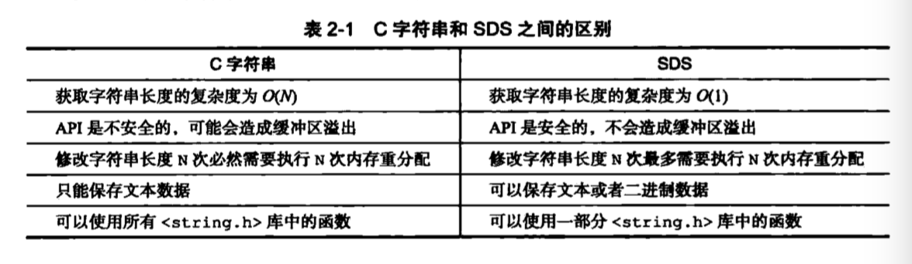
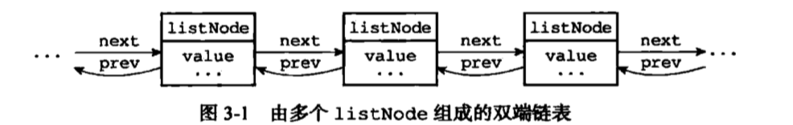
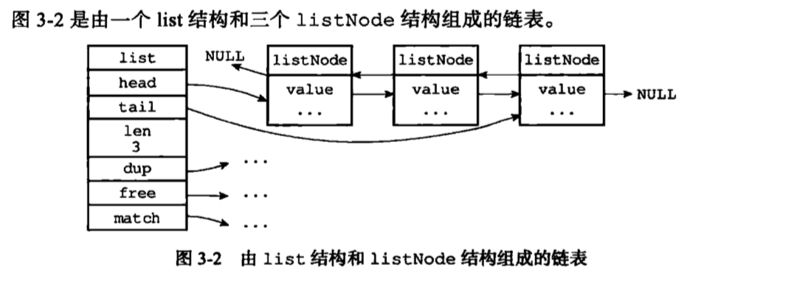

## Redis设计与实现学习笔记
### 一. 简单动态字符串

#### SDS的定义

- free属性的值为0， 表示这个SDS没有分配任何未使用空间
- len属性的值为5，表示这个SDS保存了一个五字节长的字符串
- buf属性的值是一个char类型的数组，数组的前五个字节分别保存了‘R’、‘e’、‘d’、‘i’、‘s’五个字符，而最后一个字节则保存了空字符串'\0'。

#### SDS与C字符串的区别

根据传统，C语言使用长度为N+1的字符数组来表示长度为N的字符串，并且字符数组的最后一个元素总是空字符‘\0’。

##### 1. 常熟复杂度获取字符串长度

因为C字符串并不记录自身的长度信息，所以获取一个C字符串的长度，程序必须遍历整个字符串，对遇到的每个字符进行计数，直到遇到代表字符串结尾的空字符串为止，这个操作的复杂度为O(N)。

SDS在len属性中记录了SDS本身的长度，获取一个SDS字符串的复杂度仅为O(1)。

##### 2. 杜绝缓冲区溢出

C语言执行strcat拼接字符串时，将src字符串中的内容拼接到dest字符串的末尾，先假设已经为dest分配了足够多的内存可以容纳src字符串中的所有内容，而一旦假设不成立时，则会产生缓冲区溢出。

与C字符串不同，SDS的空间分配策略完全杜绝了缓冲区溢出的可能性：当SDS API需要对SDS进行修改时，API会先检查SDS的空间是否满足修改需要的要求，如果不满足的话，API会自动将SDS的空间扩展至执行修改所需的大小，然后才执行实际的修改操作，所以使用SDS不需要手动修改SDS的空间大小。

##### 3. 减少修改字符串时带来的内存重分配次数

C语言增常或者缩短一个字符串，程序需要对保存这个字符串的数组进行一次内存重新分配：

- 如果程序执行的是增长字符串的操作，那么在执行之前，程序需要先通过内存重分配来扩展底层数组的空间大小——如果忘了这一步就会产生缓冲区溢出。
- 如果程序执行的是缩短字符串的操作，那么在执行之后，程序需要通过内存重分配来释放字符串不再使用的那部分空间——如果忘了这一步就会产生内存泄漏。

为了避免C字符串的缺陷，SDS实现了空间预分配和惰性空间两种优化策略。

###### 空间预分配

空间预分配用于优化SDS的字符串增长操作：当SDS的API对一个SDS进行修改，并且需要对SDS进行空间扩展时，程序不仅会为SDS分配修改所必须要的空间，还会为SDS分配额外的未使用空间。

额外分配的未使用空间数量由以下公式决定：

- 如果对SDS进行修改之后，SDS的长度将小于1MB，那么程序分配和len属性同样大小的未使用空间，这时SDS len属性的值将和free属性的值相同。
- 如果对SDS进行修改之后，SDS的长度大于等于1MB，那么程序会分配1MB的未使用空间。

###### 惰性空间释放

惰性空间释放用于优化SDS的字符串缩短操作：当SDS的SPI需要缩短SDS保存的字符串时，程序并不立即使用内存重分配来回收缩短多出来的字节，而是使用free属性将这些字节的数量纪录起来，并等待将来使用。

与此同时，SDS也提供了相应的API，可以在有需要时，真正地释放SDS的未使用空间。

##### 4. 二进制安全

C字符串中的字符必须符合某种编码（比如ASCII），并且除了字符串的末尾之外，字符串里面不能包含空字符，否则最先被程序读入的空字符将被误认为是字符串结尾。这些限制了C字符串只能保存文本数据，而不能保存像图片、音频、视频、压缩文件这样的二进制数据。

SDS API都是以处理二进制的方式来处理SDS存放在buf数组里的数据，程序不会对其中的数据做任何限制、过滤、或者假设，数据在写入时是什么样，它被读取时就是什么样。

##### 5. 兼容部分C字符串函数

虽然SDS的API是二进制安全的，但一样遵循C字符串以空字符结尾的惯例：这些API总会将SDS保存的数据的末尾设置为空字符，并且总会在为buf数组未分配空间时多分配一个字节来容纳这个字符串，这就是为了让那些保存文本数据的SDS可以重用一部分<string.h>库定义的函数。

#####  6. 总结

### 二. 链表

作为一种常用数据结构，链表内置于很多高级的编程语言里面，Redis使用的C语言没有内置这种数据结构，所以Redis构建了自己的链表实现。

#### 重点

- 链表被广泛应用于实现Redis的各种功能，比如列表键、发布与订阅、慢查询、监视器等。
- 每个链表节点由一个listNode结构体来表示，每个节点都有一个指向前置节点和后置节点的指针，所以Redis的链表实现是双向链表。
- 每个链表使用一个list结构来表示，这个结构带有表头节点指针、表尾节点指针，以及链表长度等信息。
- 因为链表表头节点的前置节点和表尾节点的后置节点都指向NULL，所以Redis的链表实现时无环链表。
- 通过为链表设置不同的类型特定函数，Redis的链表可以用于保存各种不同类型的值。

#### 链表和链表节点的实现

每个链接节点使用一个adlist.h/listNode结构来表示

list结构为链表提供了表头指针head、表尾指针tail，以及链表长度计数器len，而dup、free和match成员则实现多态链表所需的类型特定函数。

- dup函数用于复制链表节点所保存的值
- free函数用于释放链表节点所保存的值
- match函数用于对比链表节点所保存的值和另一个输入值是否相等

#### 总结

- 双端：链表节点带有prev和next指针，获取某个节点的前置节点和后置节点的复杂度都是O(1)。
- 无环：表头节点的prev指针和表尾节点的next指针都指向NULL，对链表的访问以NULL为终点。
- 带表头指针和表尾指针：通过list结构的head指针和tail指针，程序获取链表的表头节点和表尾节点的复杂度为O(1)。
- 带链表长度计数器：程序使用list结构的len属性来对list持有的链表节点进行技术，程序获取链表中的节点数量的复杂度为O(1)。
- 多态：链表节点使用void *指针来保存节点值，并且可以使用list结构的dup、free、match三个属性为节点值设置类型特定函数，所以链表可以用来保存各种不同类型的值。

### 三. 字典

字典，又称符号表、关联数组或映射，是一种用于保存键值对的抽象数据结构。

字典作为一种常用数据结构内置在很多高级编程语言里面，Redis使用的C语言并没有内置这种数据结构，因此Redis构建了自己的字典实现。

#### 重点

- 字典被广泛用于实现Redis的各种功能，其中包括数据库和哈希键。
- Redis中的字典使用哈希表作为底层实现，每个字典带有两个哈希表，一个平时使用，另一个劲在进行rehash时使用。
- 当字典被用于数据库的底层实现，或者哈希键的底层实现时，Redis使用MurmurHash2算法来计算键的哈希值。
- 哈希表使用链地址法来解决键冲突，被分配到同一个索引上的多个键值会连接成一个单向链表。
- 在对哈希表进行扩展或者收缩操作时，程序需要将现有哈希表包含的所有键值对rehash到新哈希表里面，并且这个rehash过程并不是一次性完成的，而是渐进式地完成的。

### 四. 跳跃表

#### 重点

- 跳跃表时有序列表的底层实现之一
- Redis的跳跃表实现由zskiplist和zskiplistNode两个结构组成，其中zskiplist用于保存跳跃表信息，而zskiplistNode则用于表示跳跃表节点。
- 每个跳跃表节点的层高都是1-32之间的随机数
- 在同一个跳跃表中，多个节点可以包含相同的分数，但是每个及诶蛋的成员对象必须是唯一的。
- 跳跃表中的节点按照分值大小进行排序，当分值相同时，节点按照成员对象的大小进行排序。

### 五. 整数集合

#### 重点

- 整数集合是集合键的底层实现之一。
- 整数集合的底层实现为数组，这个数组以有序、无重复的方式保存集合元素，在有需要时，程序会根据新添加元素的类型，改变这个数组的类型。
- 升级操作为整数集合带来了操作上的灵活性，并且尽可能地节约了内存。
- 整数集合只支持升级操作，不支持降级操作。

### 六. 压缩列表

#### 重点

- 压缩列表是一种为节约内存而开发的顺序型数据结构。
- 压缩列表被用作列表键和哈希键的底层实现之一。
- 压缩列表可以包含多个节点，每个节点可以保存一个字节数组或者整数值。
- 添加节点到压缩列表，或者从压缩列表中删除列表，可能会引发连锁更新操作，但这种操作出现的几率不高。

### 七. 对象

#### 重点

- Redis数据库中的每个键值对的键和值都是一个对象。
- Redis共有字符串、列表、哈希、集合、有序集合五种类型的对象，每种类型的对象至少都有两种或以上的编码方式，不同的编码可以在不同的使用场景上优化对象的使用效率。
- 服务器在执行某些命令之前，会先检查给定键的类型能否执行指定的命令，而检查一个键的类型就是检查键的值对象的类型。
- Redis的对象系统带有引用计数实现的内存回收机制，当一个对象不再被使用时，该对象占用的内存就会被自动释放。
- Redis会共享值为0到9999的字符串对象
- 对象会记录自己的最后一次被访问的时间，这个时间可以用于计算对象的空转时间。

#### 对象的类型与编码

Redis使用对象来表示数据库中的键和值，每当在数据库中新建一个键值对时，至少会创建两个对象，一个对象是作键值对的键，另一个对象是作键值对的值。

##### 类型

对象的类型如下：

对于Redis数据库保存的键值对来说，键总是一个字符串对象，而值则可以是字符串对象、列表对象、哈希对象、集合对象或者有序集合对象中的其中一种。

TYPE命令在面对不同类型的值对象时所产生的输出：

##### 编码和底层实现

对象的ptr指针指向对象的底层实现数据结构，而这些数据结构由对象的`encoding`属性决定的。

`encoding`属性记录了对象所使用的编码，即是这个对象使用了什么数据结构作为对象的底层实现。

### 八. 数据库

#### 重点

- Redis服务器的所有数据库都保存在redisServer.db数组中，而数据库的数量则由redisServer.dbnum属性保存。
- 客户端通过修改目标数据库指针，让它指向redisServer.db数组中不同元素来切换不同的数据库。
- 数据库主要由dict和expires两个字典构成，其中dict字典负责保存键值对，而expires字典则负责保存键的过期时间。
- 因为数据库时由字典构成的，所以对数据库的操作都是建立在字典操作智商的。
- 数据可的键总是一个字符串对象，而值则可以是任意一种Redis对象类型，包括字符串对象、哈希表对象、集合对象、列表对象和有序列表对象，分别对应字符串键、哈希键、集合键、列表键和有序集合键。
- expires字典的键指向数据库中的某个键，而值则记录了数据库键的过期时间，过期时间是一个以毫秒为单位的UNIX时间戳。
- Redis使用惰性删除和定期删除两种策略来删除过期的键：惰性删除策略只在碰到过期键时才进行删除操作，定期删除策略则每隔一段时间主动查找并删除已经过期的键。
- 执行SAVE命令或者BGSAVE命令所产生的新RDB文件不会包括已经过期的键。
- 执行BGREWRITE命令所产生的AOF文件不会包括已经过期的键。
- 当一个过期键被删除后，服务器会追加一条DEL命令到现有AOF文件的末尾，显式地删除过期键。
- 从服务器即使发现过期键也不会自作主张地删除它，而是等待主节点发来DEL命令，这种统一、去中心话的过期删除策略可以保证主从服务器数据的一致性。
- 当Redis命令对数据库进行修改之后，服务器会根据配置向客户端发送数据库通知。

### 九. RDB持久化

#### 重点

- RDB文件用于保存和还原Redis服务器所有数据库中的所有键值对数据。
- SAVE命令由服务器进程直接执行保存操作，所以该命令会阻塞服务器。
- BGSAVE命令由子进程执行保存操作，所以该命令不会阻塞服务器。
- 服务器状态中会保存所有用save选项设置的保存条件，当任意一个保存条件被满足时，服务器会自动执行BGSAVE命令。
- RDB文件是一个经过压缩的二进制文件，由多个部分组成。
- 对于不同类型的键值对，RDB文件会用不同的方式保存它们。

### 十. AOF持久化

#### 重点

- AOF文件通过保存所有修改数据库的写命令请求来记录服务器的数据库状态。
- AOF文件中的所有命令都以Redis命令请求协议的格式保存。
- 命令请求会先保存到AOF缓冲区里面，之后再定期写入并同步到AOF文件。
- appendfsync选项的不同值对AOF持久化功能的安全性以及Redis服务器的性能有很大的影响。
- 服务器只要载入并重新执行保存在AOF文件中的命令，就可以还原数据库本来的状态。
- AOF重写可以产生一个新的AOF文件，这个新的AOF文件和原有的AOF文件所保存的数据库状态一样，但体积更小。
- AOF重写是一个有歧义的名字，该功能是通过读取数据库中的键值对来实现的，程序无须对现有AOF文件进行任何读入、分析或者写入操作。
- 在执行BGREWRITEAOF命令时，Redis服务器会维护一个AOF重写缓冲区，该缓冲区会在子进程创建新AOF文件期间，服务器会将重写缓冲区中的所有内容追加到新AOF文件的末尾，使得新旧两个AOF文件所保存的数据库状态一致。最后，服务器用新的AOF文件替换旧的AOF文件，以此完成AOF文件重写操作。

### 十一. 事件

#### 重点

- Redis服务器是一个事件驱动程序，服务器处理的事件分为时间事件和文件事件两类。
- 文件事件处理器是基于Reactor模式实现的网络通信程序。
- 文件事件是对套接字操作的抽象：每次套接字变为可应答、可写或者可读时，相应的文件事件就会产生。
- 文件事件分为读事件和写事件两类。
- 时间事件分为定时事件和周期性事件：定时事件只在指定的时间到达一次，而周期性事件则每隔一段时间到达一次。
- 服务器在一般情况下只执行serverCron函数一个时间事件，并且这个事件是周期性事件。
- 文件事件和时间事件是合作关系，服务器会轮流处理两种事件，并且处理事件的过程中也不会进行抢占。
- 时间事件的实际处理时间通常会比设定的到达时间晚一些。

### 十二. 客户端

#### 重点

- 服务器状态结构使用clients链表连接多个客户端状态，新添加的客户端状态会被放到链表的末尾。
- 客户端状态的flags属性使用不同标志来表示客户端的角色，以及客户端当前所处的状态。
- 输入缓冲区记录了客户端发送的命令请求，这个缓冲区的大小不能超过1G。
- 命令的参数和参数个数会被记录在客户端状态的argv和argc属性里面，而cmd属性则记录了客户端要执行命令的实现函数。
- 客户端有固定大小缓冲区和可变大小缓冲区，如果输出缓冲区的大小超过了服务器设置的硬性限制，那么客户端会被立即关闭；除此之外，如果客户端在一定时间内，一直超过服务器设置的软性限制，那么客户端也会被关闭。
- 当一个客户端通过网络连接连上服务器时，服务器会为这个客户端创建相应的客户端状态。网络连接关闭、发送了不合协议格式的命令请求、成为CLIENT KILL命令的目标、空转时间超时、输出缓冲区的大小超出限制，以上这些原因都会造成客户端被关闭。
- 处理Lua脚本的伪客户端在服务器初始化时创建，这个客户端会一直存在，直到服务器关闭。
- 载入AOF文件时使用的伪客户端在载入工作开始时动态创建，载入工作完毕之后关闭。

### 十三. 服务器

#### 重点

- 服务器从启动到能够处理客户端的命令请求需要执行以下步骤：
  - 初始化服务器状态
  - 载入服务器配置
  - 初始化服务器数据结构
  - 还原数据库状态
  - 执行事件循环
- 一个命令请求从发送到完成主要包括以下步骤：
  - 客户端命令请求发送给服务器
  - 服务器读取命令请求，并分析命令参数
  - 命令执行器根据参数查找命令的实现函数，然后执行实现并得出命令回复
  - 服务器将命令回复返回给客户端
- serverCron函数默认每隔100毫秒执行一次，它的工作主要包括更新服务器状态信息，处理服务器接受的SIGTERM信号，管理客户端资源和数据库状态，检查并执行持久化操作等

### 十四. 复制

#### 重点

- Redis 2.8以前的复制功能不能高效地处理断线后重复复制情况，但Redis 2.8新添加的部分重同步功能可以解决这个问题。
- 部分重同步通过复制偏移量、复制积压缓冲区、服务器运行ID三个部分来实现。
- 在复制操作刚开始的时候，从服务器会成为主服务器的客户端，并通过向主服务器发送命令请求来执行这些复制步骤，而在复制操作的后期，主从服务器会互相成为对方的客户端。
- 主服务器通过向从服务器传播命令来更新从服务器的状态，保持主从服务器一致，而从服务器则通过向主服务器发送命令来进行心跳检测，以及命令丢失检测。

### 十五. Sentinel

#### 重点

- Sentinel只是一个运行在特殊模式下的Redis服务器，它使用了和普通模式不同的命令表，所以Sentinel模式能够使用的命令和普通模式Redis服务器能够使用的命令不同。
- Sentinel会读入用户指定的配置文件，为每个要被监视的主服务器创建相应的实例结构，并创建连向主服务器的命令连接和订阅连接，其中命令连接用于向主服务器发送命令请求，而订阅连接则用于接收指定频道的消息。
- Sentinel通过向主服务器发送INFO命令来获得主服务器属下所有从服务器的地址信息，并为这些从服务器创建相应的实例结构，以及连接向这些从服务器的命令连接和订阅连接。
- 在一般情况下，Sentinel以每十秒一次的频率向被监视的主服务器和从服务器发送INFO命令，当主服务器处于下线状态，或者Sentinel正在对主服务器进行故障转移操作时，Sentinel向从服务器发送INFO命令的频率会改为每秒一次。
- 对于监视同一个主服务器和从服务器的多个Sentinel来说，它们会以每两秒一次的频率，通过向被监视服务器的\__sentinel__:hello频道发送消息来向其他Sentinel宣告自己的存在。
- 每个Sentinel也会从\__sentinel__:hello频道中接收其他Sentinel发来的信息，并根据这些信息为其他Sentinel创建相应的实例结构，以及命令连接。
- Sentinel只会与主服务器和从服务器创建命令连接和订阅连接，Sentinel和Sentinel之间只会创建命令连接。
- Sentinel以每秒一次的频率向实例（包括主服务器、从服务器、其他Sentinel）发送PING命令，并根据实例对PING命令的回复来判断实例是否在线，当一个实例在指定的时长连续向Sentinel发送无效回复时，Sentinel会将这个实例判断为主观下线状态。
- 当Sentinel将一个主服务器判断为主观下线时，它会同样件事这个主服务器的其他Sentinel进行询问，看它们是否同意这个主服务器已经进入主观下线状态。
- 当Sentinel收集到足够多的主观下线投票之后，它会将主服务器判断为客观下线，并发起一次针对主服务器的故障转移操作。

### **十六**. 集群

#### 重点

- 节点通过握手来将其他节点添加到自己所处的集群当中。
- 集群中的16384个槽可以分别指派给集群中的各个节点，每个节点都会记录哪些槽指派给了自己，而哪些槽又被指派给了其他节点。
- 节点在接到一个命令请求时，会先检查这个命令请求要处理的键所在的槽是否由自己负责，如果不是的话，节点将向客户端返回一个MOVED错误，MOVED错误携带的信息可以指引客户端转向至正在负责相关槽的节点。
- 对Redis集群的重新分片工作是由redis-trib负责执行的，重新分片的关键是将属于某个槽的所有键值对从一个节点转移到另一个节点。
- 如果节点A正在迁移槽i至节点B，那么节点A没能在自己的数据库中找到命令指定的数据库键时，节点A会向客户端返回一个ASK错误，指引客户端到节点B继续查找指定的数据库键。
- MOVED错误表示槽的负责权已经从一个节点转移到另一个节点，而ASK错误只是两个节点在迁移槽的过程中使用的一种临时措施。
- 集群里的从节点用于复制主节点，并在主节点下线时，代管主节点继续处理命令请求。
- 集群中的节点通过发送和接收消息来进行通信，常见的消息包括MEET、PING、PONG、PUBLISH、FAIL五种。

### 十七. 发布与订阅

#### 重点

- 服务器状态在pubsub_channels字典保存了所有频道的订阅关系：SUBSCRIBE命令负责将客户端和被订阅的频道关联到这个字段里面，而UNSUBSCRIBE命令则是解除客户端和被退订频道之间的关联。
- 服务器状态在pubsub_patterns链表保存了所有模式的订阅关系：PSUBSCRIBE命令负责将客户端和被订阅的模式记录到这个链表中，而PUNSUBSCRIBE命令则负责移除客户端和被退订模式在链表中的记录。
- PUBLISH命令通过访问pubsub_channels字典来向频道的所有订阅者发送消息，通过访问pubs_channels链表来向所有匹配频道的模式的订阅者发送消息。
- PUBSUB命令的三个子命令都是通过读取pusub_channels字典和pubsub_patterns链表中的信息来实现的。

### 十八. 事务

#### 重点

- 事务提供了一种将多个命令打包，然后一次性、有序地执行的机制。
- 多个命令会被入队到事务队列中，然后按先进先出（FIFO）的顺序执行。
- 事务在执行过程中不会被中断，当事务队列中的所有命令都被执行完毕之后，十五才会结束。
- 带有WATCH命令的事务会将客户端和被监视的键在数据库watch_keys字典中进行关系，当键被修改时，程序会将所有监视被修改键的客户端的REDIS_DIRTY_CAS标志打开。
- 只有在客户端的REDIS_DIRTY_CAS标志未被打开时，服务器才会执行客户端提交的事务，否则的话，服务器将拒绝执行客户端提交的事务。
- Redis的事务总是被具有ACID中的原子性、一致性和隔离性，当服务器运行在AOF持久化模式下，并且appendfsync选项的值为always时，事务也具有耐久性。

### 十九. Lua脚本

#### 重点

- Redis服务器在启动时，会对内嵌的Lua环境执行一系列修改操作，从而确保内嵌的Lua环境可以满足Redis在功能性、安全性等方面的需要。
- Redis服务器专门使用一个伪客户端来执行Lua脚本中包含的Redis命令。
- Redis使用脚本字典来保存所有被EVAL命令执行过，或者被SCRIPT LOAD命令载入过的Lua脚本，这些脚本可以用于实现SCRIPT EXISTS命令，以及实现脚本复制功能。
- EVAL命令为客户端输入的脚本在Lua环境中定义一个函数，并通过调用这个函数来执行脚本。
- EVALSHA命令通过直接调用Lua环境中已定义的函数来执行脚本。
- SCRIPT FLUSH命令会清空服务器lua_scripts字典中保存的脚本，并重置Lua环境。
- SCRIPT EXISTS命令接受一个或多个SHA1校验和为参数，并通过检查lua_scripts字典来确认校验和对应的脚本是否存在。
- SCRIPT LOAD命令接受一个Lua脚本为参数，为该脚本在Lua环境中创建函数，并将脚本保存到lua_scripts字典中。
- 服务器在执行脚本之前，会为Lua环境设置一个超时处理钩子，当脚本出现超时运行情况时，客户端可以通过向服务器发送SCRIPT KILL命令来让钩子停止正在执行的脚本，或者发送SHUTDOWN nosave命令来让钩子关闭整个服务器。
- 主服务器复制EVAL、SCRIPT FLUSH、SCRIPT LOAD三个命令的方法和复制普通Redis命令一样，只要将相同的命令传播给从服务器即可。
- 主服务器在复制EVALSHA命令时，必须确保所有从服务器都已经载入了EVALSHA命令指定的SHA1校验和所对应的Lua脚本，如果不能确保这一点的话，主服务器会将EVALSHA命令转换成等效的EVAL命令，并通过传播EVAL命令来获得相同的脚本执行效果。

### 二十. 排序

#### 重点

- SORT命令通过将被排序键包含的元素载入到数组里面，然后对数组进行排序来完成对键进行排序的工作。
- 在默认情况下，SORT命令假设被排序键包含的都是数字值，并且以数字值的方式来进行排序。
- 如果SORT命令使用了ALPHA选项，那么SORT命令假设被排序键包含的都是字符串值，并且以字符串的方式来进行排序。
- SORT命令的排序操作都是由快速排序算法实现。
- SORT命令会根据用户是否使用DESC选项来决定是使用升序对比还是降序对比来比较被排序的元素，升序对比会产生升序排序结果，被排序的元素按值的大小从小到大排序，降序对比会产生降序排序结果，被排序的元素按值的大小从大到小排序。
- 当SORT命令使用BY选项时，命令使用其他键的值作为权重来进行排序操作。
- 当SORT命令使用LIMIT选项时，命令只保留排序结果集中LIMIT选项指定的元素。
- 当SORT命令使用GET选项时，命令会根据排序结果集中的元素，以及GET选项给定的模式，查找并返回其他键的值，而不是返回被排序的元素。
- 当SORT命令使用了STORE选项时，命令会将排序结果保存在指定的键里面。
- 当SORT命令同时使用多个选项时，命令会先执行排序操作，然后执行LIMIT操作，之后执行GET选项，再之后执行STORE选项，最后才会将排序结果集返回给客户端。
- 除了GET选项之外，调整选项的摆放位置不会影响SORT命令的排序结果。

### 二十一. 二进制位组

#### 重点

- Redis使用SDS来保存位数组。
- SDS使用逆序来保存位数组，这种保存顺序简化了SETBIT命令的实现，使得SETBIT命令可以在不移动现有二进制的情况下，对位数组进行空间扩展。
- BITCOUNT命令使用了查表算法和variable-previsionSWAR算法来优化命令的执行效率。
- BITOP命令的所有操作都使用C语言内置的位操作来实现。

### 二十二. 慢查询日志

#### 重点

- Redis的慢查询日志功能用于记录执行时间超过指定时长的命令
- Redis服务器将所有的慢查询日志保存在服务器状态的slowlog链表中，每个链表节点都包含一个slowlogEntry结构，每个slowlogEntry结构代表一条慢查询日志。
- 打印和删除慢查询日志可以通过遍历slowlog链表来完成。
- slowlog链表长度就是服务器所保存慢查询日志的数量。
- 新的慢查询日志会被添加到slowlog链表的表头，如果日志的数量超过slowlog-max-len选项的值，那么多出来的日志会被删除。

### 二十三. 监视器

#### 重点

- 客户端可以通过执行MONITOR命令，将客户端转换成监视器，接收并打印服务器处理的每个命令请求的相关信息。
- 当一个客户端从普通客户端变为监视器时，该客户端的REDIS_MONITOR标识会被打开。
- 服务器将所有监视器记录在monitor链表中。
- 每次处理命令请求时，服务器都会遍历monitor链表，将相关信息发送给监视器。