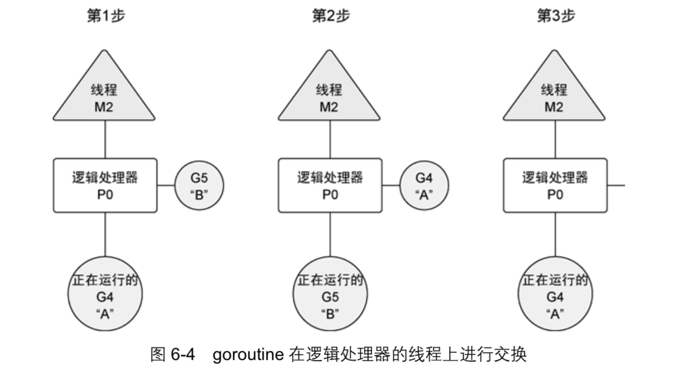
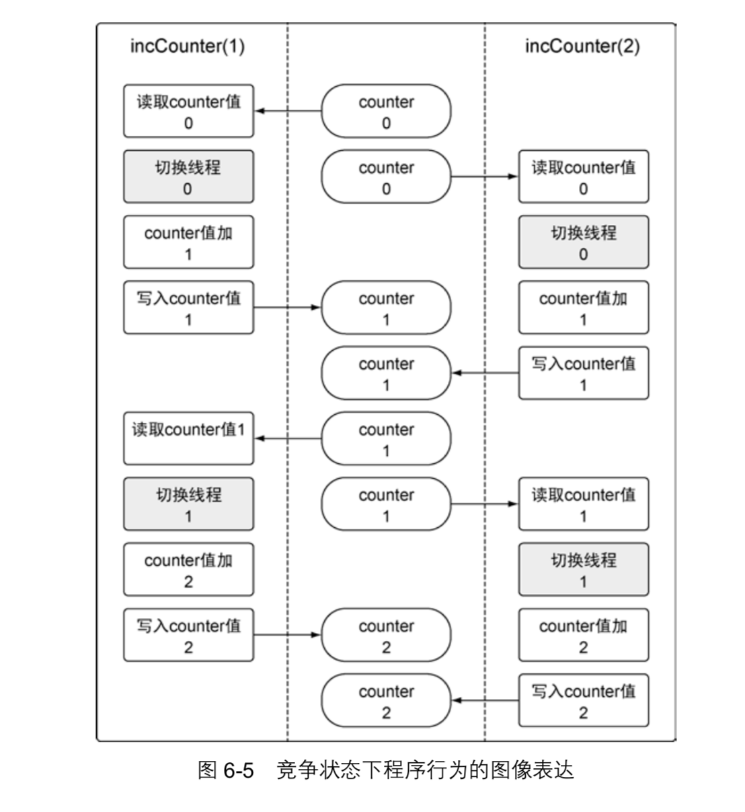
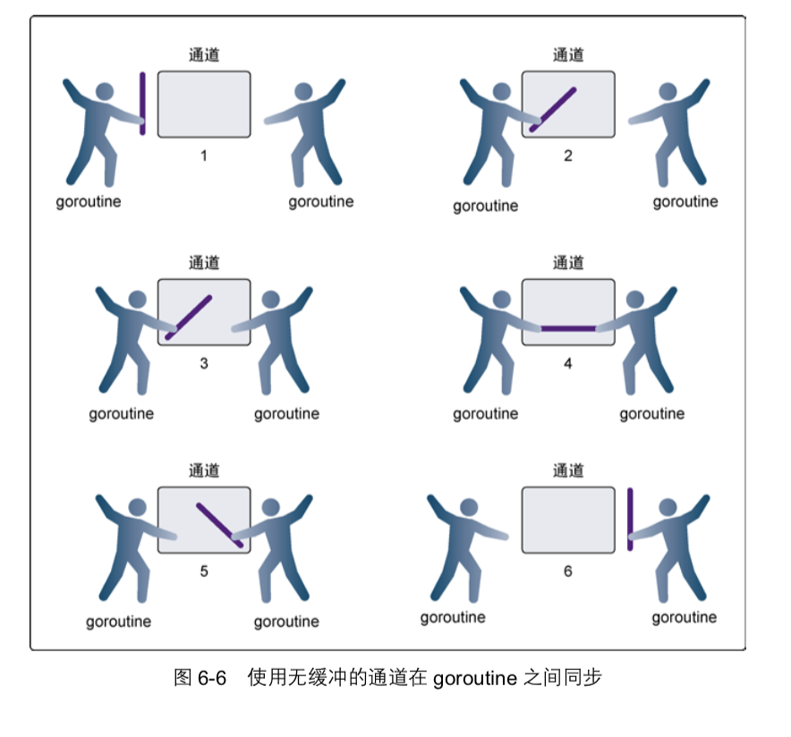

## 并发

- 利用goroutine运行程序
- 检测并修正竞争状态
- 利用通道共享数据

Go 语言的并发同步模型来自一个叫作通信顺序进程(Communicating Sequential Processes，CSP) 的范型(paradigm)。
CSP 是一种消息传递模型，通过在 goroutine 之间传递数据来传递消息，而不是 对数据进行加锁来实现同步访问。
用于在 goroutine 之间同步和传递数据的关键数据类型叫作通道(channel)。

### 并发与并行


操作系统会在物理处理器上调度线程来运行，而 Go 语言的运行时会在逻辑处理器上调度 goroutine来运行。 

Go语言的 运行时默认会为每个可用的物理处理器分配一个逻辑处理器。在 1.5 版本之前的版本中，默认给 整个应用程序只分配一个逻辑处理器。这些逻辑处理器会用于执行所有被创建的goroutine。即便只有一个逻辑处理器，Go也可以以神奇的效率和性能，并发调度无数个goroutine。 


如果创建一 个 goroutine 并准备运行，这个 goroutine 就会被放到调度器的全局运行队列中。之后，调度器就 将这些队列中的 goroutine 分配给一个逻辑处理器，并放到这个逻辑处理器对应的本地运行队列中。本地运行队列中的 goroutine 会一直等待直到自己被分配的逻辑处理器执行。 

有时，正在运行的 goroutine 需要执行一个阻塞的系统调用，如打开一个文件。当这类调用 发生时，线程和 goroutine 会从逻辑处理器上分离，该线程会继续阻塞，等待系统调用的返回。 与此同时，这个逻辑处理器就失去了用来运行的线程。所以，调度器会创建一个新线程，并将其 绑定到该逻辑处理器上。之后，调度器会从本地运行队列里选择另一个 goroutine 来运行。一旦 被阻塞的系统调用执行完成并返回，对应的 goroutine 会放回到本地运行队列，而之前的线程会 保存好，以便之后可以继续使用。 

如果一个 goroutine 需要做一个网络 I/O 调用，流程上会有些不一样。在这种情况下，goroutine 会和逻辑处理器分离，并移到集成了网络轮询器的运行时。一旦该轮询器指示某个网络读或者写 操作已经就绪，对应的 goroutine 就会重新分配到逻辑处理器上来完成操作。调度器对可以创建 的逻辑处理器的数量没有限制，但语言运行时默认限制每个程序最多创建 10 000 个线程。这个 限制值可以通过调用 runtime/debug 包的 SetMaxThreads 方法来更改。如果程序试图使用 更多的线程，就会崩溃。 

#### 并发(concurrency)不是并行(parallelism)。 

- 并行是让不同的代码片段同时在不同的物理处 理器上执行。
- 并行的关键是同时做很多事情，而并发是指同时管理很多事情，这些事情可能只做 了一半就被暂停去做别的事情了。

在很多情况下，并发的效果比并行好，因为操作系统和硬件的 总资源一般很少，但能支持系统同时做很多事情。

如果希望让 goroutine 并行，必须使用多于一个逻辑处理器。当有多个逻辑处理器时，调度器会将 goroutine 平等分配到每个逻辑处理器上。这会让 goroutine 在不同的线程上运行。  

不过要想真的实现并行的效果，用户需要让自己的程序运行在有多个物理处理器的机器上。否则，哪怕 Go 语 言运行时使用多个线程，goroutine 依然会在同一个物理处理器上并发运行，达不到并行的效果。 


### goroutine 

了解一下调度器的行为，以及调度器是如何创建 goroutine 并管理其寿命的。 

[listing01.go](./listing01.go)




- 如何修改逻辑处理器的数量 

```go
import "runtime"
// 给每个可用的核心分配一个逻辑处理器 
runtime.GOMAXPROCS(runtime.NumCPU())
```

包 runtime 提供了修改 Go 语言运行时配置参数的能力。 

函数 NumCPU 返回可以使用的物 理处理器的数量。因此，调用 GOMAXPROCS 函数就为每个可用的物理处理器创建一个逻辑处理 器。需要强调的是，使用多个逻辑处理器并不意味着性能更好。在修改任何语言运行时配置参数 的时候，都需要配合基准测试来评估程序的运行效果。 

### 竞争状态

如果两个或者多个 goroutine 在没有互相同步的情况下，访问某个共享的资源，并试图同时 读和写这个资源，就处于相互竞争的状态，这种情况被称作竞争状态(race candition)。 

对一个共享资源的读和写操作必须是原子化的，换句话说，同一时刻只能有一个 goroutine 对共享资源进行读和写操作。 



### 锁住共享资源

Go 语言提供了传统的同步 goroutine 的机制，就是对共享资源加锁。
如果需要顺序访问一个 整型变量或者一段代码，atomic 和 sync 包里的函数提供了很好的解决方案。

#### 原子函数
原子函数能够以很底层的加锁机制来同步访问整型变量和指针。

使用了 atmoic 包的 AddInt64 函数。这个函数会同步整型值的加法， 方法是强制同一时刻只能有一个 goroutine 运行并完成这个加法操作。
当 goroutine 试图去调用任 何原子函数时，这些 goroutine 都会自动根据所引用的变量做同步处理。
[listing13.go](./listing13.go)

另外两个有用的原子函数是 LoadInt64 和 StoreInt64。这两个函数提供了一种安全地读 和写一个整型值的方式。
[listing15.go](./listing15.go)

#### 互斥锁
另一种同步访问共享资源的方式是使用互斥锁(mutex)。互斥锁这个名字来自互斥(mutual exclusion)的概念。
互斥锁用于在代码上创建一个临界区，保证同一时间只有一个 goroutine 可以执行这个临界区代码。

[listing16.go](./listing16.go)

### 通道

原子函数和互斥锁都能工作，但是依靠它们都不会让编写并发程序变得更简单，更不容易出 错，或者更有趣。
在 Go 语言里，你不仅可以使用原子函数和互斥锁来保证对共享资源的安全访 问以及消除竞争状态，还可以使用通道，通过发送和接收需要共享的资源，在goroutine之间做同步。

当一个资源需要在 goroutine 之间共享时，通道在 goroutine 之间架起了一个管道，并提供了确保同步交换数据的机制。
声明通道时，需要指定将要被共享的数据的类型。可以通过通道共享内置类型、命名类型、结构类型和引用类型的值或者指针。
 
- 使用make创建通道
```go
// 无缓冲的整型通道
unbuffered := make(chan int)

// 有缓冲的字符串通道
buffered := make(chan string, 10)

// 通过通道发送一个字符串
buffered <- "Gopher"

// 从通道接收一个字符串
// 当从通道里接收一个值或者指针时，<-运算符在要操作的通道变量的左侧
value := <-buffered
```

#### 无缓冲的通道
- 无缓冲的通道(unbuffered channel)是指在接收前没有能力保存任何值的通道。
- 这种类型的通 道要求发送 goroutine 和接收 goroutine 同时准备好，才能完成发送和接收操作。
- 如果两个 goroutine 没有同时准备好，通道会导致先执行发送或接收操作的 goroutine 阻塞等待。
- 这种对通道进行发送 和接收的交互行为本身就是同步的。其中任意一个操作都无法离开另一个操作单独存在
[listing20.go](./listing20.go)



#### 有缓冲的通道
- 有缓冲的通道(buffered channel)是一种在被接收前能存储一个或者多个值的通道。
- 这种类型的通道并不强制要求 goroutine 之间必须同时完成发送和接收。
- 通道会阻塞发送和接收动作的条件也会不同。只有在通道中没有要接收的值时，接收动作才会阻塞。
- 只有在通道没有可用缓冲区容纳被发送的值时，发送动作才会阻塞。
这导致有缓冲的通道和无缓冲的通道之间的一个很大的不同:无缓冲的通道保证进行发送和接收的 goroutine 会在同一时间进行数据交换;有缓冲的通道没有这种保证。
[listing24.go](./listing24.go)

由于程序和 Go 语言的调度器带有随机成分，这个程序每次执行得到的输出会不一样。不过， 通过有缓冲的通道，使用所有 4 个 goroutine 来完成工作，这个流程不会变。
从输出可以看到每个 goroutine 是如何接收从通道里分发的工作。

### 小结

- 并发是指goroutine运行的时候是相互独立的。
- 使用关键字go创建goroutine来运行函数。
- goroutine在逻辑处理器上执行，而逻辑处理器具有独立的系统线程和运行队列。
- 竞争状态是指两个或者多个goroutine试图访问同一个资源。
- 原子函数和互斥锁提供了一种防止出现竞争状态的方法。
- 通道提供了一种在两个goroutine之间共享数据的简单方法。
- 无缓冲的通道保证同时交换数据，而有缓冲的通道不做这种保证。


