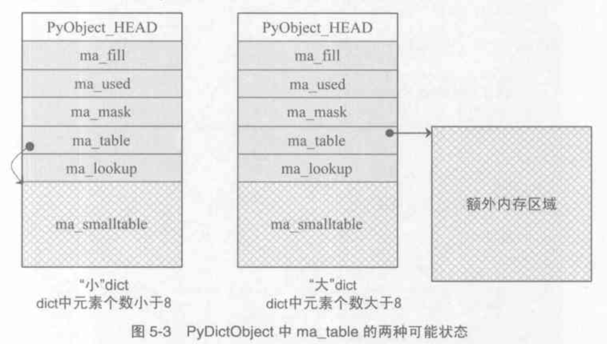

## Python源码剖析学习笔记

### 一. Python源码剖析——编译Python
#### Python总体架构

在最高的层次上，Python的整体架构可以分为三个主要的部分，如上。

图左，是Python提供的大量的模块/库以及用户自定义的模块。比如在执行`import os`时，这个`os`是Python内建的模块，用户还可以通过自定义模块来扩展Python系统。

图右，是Python的运行时环境，包括对象/类型系统（Object/Type structures），内存分配器（Memory Alloator）和运行时状态信息（Current State of Python）。

- 对象/类型系统则包含了Python中存在的各种内建对象，比如int/list/dict，以及用户自定义的各种类型和对象。

- 内存分配器则全权负责Python中创建对象时，对内存的申请工作，实际上它就是Python运行时与C中`malloc`的一层接口。
- 运行时状态维护了解释器在执行字节码时不同的状态之间的切换的动作，可视它为一个巨大而复杂的有穷状态机。

图中，是Python的核心——解释器（interpreter），或者称为虚拟机。在解释器中，箭头的方向指示了Python运行过程中的数据流方向。

- Scanner对应词法分析，讲文件输入的Python源代码或者从命令行输入的一行行Python代码切分为一个个的token
- Parser对应语法分析，在Scanner的分析结果上进行语法分析，建立抽象语法树（AST）
- Compiler是根据建立的AST生成指令集合——Python字节码
- Code Evaluator执行以上的字节码，因此，Code Evaluator又可称为虚拟机

以上，在解释器与右边的对象/类型系统，内存分配器之间的箭头表示“使用”关系；与运行时状态之间的箭头表示“修改”关系，即是Python在运行的过程中会不断修改当前解释器所处的状态，在不同状态之间切换。

#### Python源代码的组织

`Include`：该目录包含了Python提供的所有头文件，如果用户需要自己用C或C++来编写自定义模块来扩展Python，那么需要这里提供的头文件。

`Lib`：该目录包含了Python自带的所有标准库，Lib中的库都是用Python语言写的。

`Modules`：该目录包含了所有用C语言编写的模块，`Modules`中的模块时那些对速度要求非常严格的模块，而有一些对速度没有太严格要求的模块，则用Python语言编写。

`Parser`：该目录包含了Python解释器中的Scanner和Parser，即对Python源代码进行词法分析和语法分析的部分。除了这些，Parser目录下还包含了一些有用的工具，这些工具可以根据Python语言的语法自动生成Python语言的词法和语法分析器。

`Objects`：该目录包含了Python的所有内建对象，包含整数/list/dict等。同时，该目录还包括了Python在运行时需要的所有的内部使用对象的实现。

`Python`：该目录包含了Python解释器中的Compiler和执行引擎部分，是Python运行核心所在。

`PCBuild`：该目录包含了Visual Studio 2003使用的工程文件，研究Python源代码就从这里开始。

`PCBuild8`：该目录包含了Visual Studio 2005使用的工程文件。

### 二. Python对象初探

#### Python内的对象

##### 1. 对象的概念

- 对于人的思维来说，对象是一个形象的概念，而对于计算机，对象却是一个抽象的概念，它所知道的只是字节。
- 通常来说，对象是数据以及基于这些数据的操作的集合。
- 在计算机中，一个对象实际上就是一片被分配的内存空间，这些内存有可能是连续的，也有可能是离散的，在更高层次上，这些内存可以当作一个整体来考虑，这个整体就是对象。
- 在这片内存中，存储着一系列的数据以及可以对这些数据进行修改或者读取操作的一系列代码。

##### 2. 对象的特点

- 在Python中，对象就是为C中的结构体在堆上申请的一块内存。
- 在Python中，所有的内建的类型对象都是被静态初始化的。（一般来说，对象是不能被静态初始化的，并且不能在栈空间上生存。唯一的例外就是类型对象）
- 在Python中，一个对象一旦被创建，它在内存中的大小就是不变的了。（这就意味着那些需要容纳可变长度数据的对象只能在对象内维护一个指向一块可变大小的内存区域的指针）

##### 3. 对象的分类

Python的对象从概念上可以大致分为五类，这种分类不一定正确，不过可以提供另外一个角度看待Python中的对象。

- Fundamental 对象：类型对象

- Numeric 对象：数值对象

- Sequence 对象：容纳其他对象的序列集合对象

- Mapping 对象：类似于C++中的map的关联对象

- Internal 对象：Python的虚拟机在运行时内部使用的对象

  

##### 4. 对象机制的基石

在Python中，所有的东西都是对象，而所有的对象都拥有一些相同的内容（这句话的另外意思是，每一个Python对象除了必须有这个PyObject内容外，还占有额外的内存，放置其他内容），这些内容在PyObject中定义，出现在每一个Python对象所占有的内存的最开始的字节中，PyObject是整个Python对象机制的核心。

PyObject定义如下：

- 在PyObject定义中，整型变量`ob_refcnt`与Python的内存管理机制有关，它实现了基于引用计数的垃圾回收机制。
- 在`ob_refcnt`之外，还有一个`ob_type`指向结构体`_typeobject`的指针，这个结构体对应着Python内部的一种特殊对象，它是用来指定一个对象类型的类型对象。

在Python中，对象机制的核心非常简单，一个是引用计数，一个是类型信息。

##### 5. 定长对象和变长对象

不包括可变长数据的对象称为定长对象（例如整数对象）。

包括可变长数据的对象称为变长对象（例如字符串对象）。

区别在于定长对象的不同对象占用的内存大小是一样的，变长对象的不同对象占用的内存大小是不一样的。

##### 6. 可变对象和不可变对象

可变对象是一旦创建后内容还可改变，但是地址不会发生改变，即该变量指向原来的对象。（例如list，dict）

不可变对象是一旦创建后内容不可改变，如果更改，则变量会指向一个新的对象。（例如int，string，float，tuple）

#### 类型对象

##### 1. 对象的元信息

结构体`_typeobject`：

在`_typeobject`的定义中包含了很多信息，主要分为四类：

- 类型名，`tp_name`
- 创建该类型对象时分配的内存空间大小信息，`tp_basicsize`和`tp_itemsize`
- 与该类型对象相关联的操作信息，`tp_print`等函数指针
- 描述该类型对象的类型信息

##### 2. 对象的创建

一般来说，Python创建对象时会有两种方法，一种是通过`Python C API`来创建，一种是通过类型对象`PyInt_Type`。

`Python C API`分成两类：

一类称为范型的API，或者称为AOL（Abstract Object Layer）。这类API都具有PyObject_***的形式，可应用在任何Python对象上。

另一类是与类型相关的API，或者称为COL（Concrete Object Layer）。这类API通常只能作用在某一种类型的对象上，对于每一种内建对象，Python都提供了这样的一组API。

无论是使用哪一种`Python C API`，Python内部都是直接分配内存的。

##### 3. 对象的行为

在PytypeObject中定义了大量的函数指针，这些函数指针最终会指向某个函数，或者指向NULL。这些函数可以视为类型对象中所定义的操作，而这些操作直接决定着一个对象在运行时所表现出的行为。

##### 4. 类型的类型

Python的类型对象`PyTypeObject`也是一个对象，是由`PyType_Type`创建的。

`PyType_Type`是Python类型机制中一个至关重要的对象，所有用户自定义class所对应的`PyTypeObject`对象都是由这个对象创建。

`PyType_Type`是所有class的class，在Python中被称为`metaclass`。

#### 多态性

在Python中创建对象，比如`PyIntObject`对象时，会分配内存，进行初始化。Python内部会用一个`PyObject *`变量来保存和维护这个对象，而不是`PyIntObject *`，其他对象也与此类似。

因此，在Python内部各个函数之间传递的是一种范型指针`PyObject *`，这个指针所指对象的`ob_type`域动态进行判断，通过这个域，Python实现了多态机制。

#### 对象的引用计数

Python通过对一个对象的引用计数的管理来维护对象在内存中的存在与否。Python的每个对象都有`ob_refcnt`变量，这个变量维护着对象的引用计数，从而决定着该对象的创建与消亡。

在Python中，主要是通过`Py_INCREF(op)`和`Py_DECREF(op)`两个宏来增加和减少一个对象的引用计数。当一个对象的引用计数减少到0之后，`Py_DECREF`将调用该对象的析构函数释放该对象所占有的内存和系统资源。

此处调用析构函数并不意味着最终会调用`free`函数来释放内存空间，如果这样做的话，频繁申请内存和释放内存，会导致Python的执行效率大打折扣。

一般来说，Python中大量采用了内存对象池的技术，调用析构函数时，通常是将该对象所占有的空间归还给内存池中，避免了频繁地申请和释放内存。

> Tips: 在Python的各种对象中，类型对象是超越引用计数规则的，永远不会被析构，每一个对象中指向类型对象的指针不会被视为对该类型对象的引用。

### 三. Python中的整数对象

#### PyIntObject对象

##### 1. PyIntObject对象的定义 

- Python中的整数对象`PyIntObject`实际上是C中原生类型long的一个简单包装。
- Python中的对象的相关元信息实际上都是保存在对应的类型对象中的，对于`PyIntObject`，类型对象是`PyInt_Type`。

#### PyIntObjecy对象的创建和维护

##### 1. 对象创建的三种途径

- 从long值生成`PyIntObject`对象
- 从字符串生成`PyIntObject`对象
- 从Py_UNICODE对象生成`PyIntObject`对象

##### 2. 小整数对象

在Python对象中，所有的对象都是生活在堆上，如果没有特殊的机制的话，那么Python将一次又一次使用malloc在堆上申请空间和释放空间，基于此种情况，对于小整数引入了对象池技术。

在Python2.5中，将小整数集合的范围默认设定为[-5, 257]，可修改NSMALLNEGINTS和NSMALLPOSINTS的值，重新编译Python，从而将这个范围向两端伸展或收缩。

##### 3. 大整数对象

对于小整数，在小整数对象池中完全地缓存了其`PyIntObject`对象，而对其他整数，Python运行环境将提供一块内存空间，这些内存空间将由大整数轮流使用。

在Python中，有一个`PyIntBlock`结构，在这个结构的基础上，实现了一个单向列表。

##### 4. 添加和删除

`PyIntObject`对象的创建通过两部完成：

- 如果小整数对象池被激活，则尝试小整数对象池
- 如果不能使用小整数对象池，则使用通用的整数对象池

### 四. Python中的字符串对象

#### PyStringObject对象

##### 1. PyStringObject对象的定义 

- 对于`PyStringObject`，类型对象是`PyString_Type`。
- `ob_size`变量保存着对象中维护的可变长度内存的大小，`ob_sval`指向一段长度为ob_size+1个字节的内存。
- `ob_hash`变量是缓存对象的hash值。
- `ob_sstate`变量标记了该对象是否已经过intern机制的处理。

#### 字符串对象的intern机制

`PyStringObject`对象的intern机制的目的是：对于被intern之后的字符串，比如说“Python”，在整个Python的运行期间，系统中只有唯一的一个与字符串“Python”对应的`PyStringObject`对象。

intern机制的核心是在系统中有一个（key，value）映射关系的集合，集合的名称叫做interned。在这个集合中，记录着被intern机制处理过的`PyStringObject`对象。

#### 字符串缓冲池

在Python的整数对象体系中，小整数的缓冲池是在Python初始化时被创建的，而字符串对象体系中的字符串缓冲池则是以静态变量的形式存在着的。

在创建`PyStringObject`时，会首先检查所要创建的是否是一个字符对象，然后检查字符串缓冲池中是否已经有了这个字符的字符对象的缓冲，如果有，则直接返回这个缓冲对象即可。

#### PyStringObject效率相关问题

Python中一个举足轻重的问题——字符串拼接。

Python提供了“+”操作符来进行字符串拼接的功能，其效率十分低下，其根源在于Python中的`PyStringObject`对象是一个不可变对象，这就意味着当进行进行字符串拼接时，实际上要创建一个`PyStringObject`对象，如果需要连接N个`PyStringObject`对象，那么必须进行N-1次的内存申请搬运工作。

官方推荐的做法是通过`PyStringObject`对象的join操作来对存储在list或者tuple中的一组`PyStringObject`对象进行连接操作，这种做法只需要分配一次内存，大大提供执行效率。

执行join操作时，会先统计出list中一共有多少个`PyStringObject`对象，并统计这些`PyStringObject`对象所维护的字符串一共有多长，然后申请内存，将list中`PyStringObject`对象维护的字符串都拷贝到新开辟的内存空间中。

### 五. Python中的List对象

#### PyListObject对象

##### 1. PyListObject对象的定义 

- 对于`PyListObject`，类型对象是`PyList_Type`。
- `**ob_item`这个指针指向元素列表所在的内存块的首地址。
- `allocated`则维护了当前列表中的可容纳的元素的总数。

#### PyListObject对象的创建和维护

##### 1. 创建对象

Python提供了一个`PyList_New`函数来创建列表，这个函数接受一个size参数，从而允许可以在创建一个`PyListObject`对象的同时指定该列表初始的元素个数。

##### 2. 设置元素

假设创建一个包含6个元素的`PyListObject`对象，也就是通过`PyList_New`函数创建`PyListObject`对象，当完成之后，`PyListObject`对象的情形应该如下：

当把一个整数对象100放置到第四个位置时，Python会进行类型检查，再进行索引检查，随后将待加入的PyObject *指针放到指定位置，调整引用计数，将这个位置原来存放的对象的引用计数减1。

##### 3. 插入元素

设置元素不会使得`ob_item`指向的内存发生变化，插入元素有可能使得`ob_item`指向的内存发生变化。

在调整`PyListObject`对象所维护的列表的内存时，Python分两种情况处理：

- newsize \< allocated && new size > allocated/2 简单调整`ob_item`值
- 其他情况，调用realloc，重新分配空间

##### 4. 删除元素

当Python执行list.remove(3)时，`PyListObject`对象中的`listremove`操作将会被激活，对整个列表进行遍历，将待删除的元素与`PyListObject`对象中的每个元素一一比较，如果匹配，则删除该元素。

####PyListObject对象缓冲池

在创建一个新的list时，创建过程分为两步，首先创建`PyListObject`对象，然后创建`PyListObject`对象所维护的元素列表。

与之对应的，在销毁一个list时，先销毁`PyListObject`对象所维护的元素列表，然后释放`PyListObject`对象自身。

在删除`PyListObject`对象自身时，Python会检查`PyListObject`对象缓冲池，查看其中缓存的`PyListObject`的数量是否已经满了，如果没有，就将该待删除的`PyListObject`对象放到缓冲池中，以备后用。

在Python下一次创建新的list时，这个`PyListObject`对象将重新被唤醒，重新分配`PyObject *`元素列表占用的内存，重新分配新的对象。

### 六. Python中的Dict对象

#### 关联容器

为了刻画某种对应关系，现代的编程语言通常都在语言级或者标准库中提供某种关联式的容器。关联式的容器中存储着一对对符合该容器所代表的关联规则的元素对，通常是以键值对的形式存在。

关联容器的设计总会极大的关注健的搜索效率，例如C++的STL中的map的实现是基于RB-tree（红黑树），理论上，其搜索的时间复杂度为O($\log_2$N)。

Python同样提供了关联式容器，即`PyDictObject`对象，采用了散列表（hash table），理论上，在最优的情况下，其搜索的时间复杂度为O(1)。

#### 散列表概述

散列表的基本思想，是通过一定的函数将需搜索的键值映射为一个整数，将这个整数视为索引值去访问某片连续的内存区域。

用于映射的函数称为散列函数，而映射后的值称为元素的散列值。在散列表的视线中，所选择的散列函数的优劣将直接决定所实现的散列表的搜索效率高低。

散列表在使用过程中，不同的对象经过散列函数的作用，可能被映射为相同的散列值，而且随着存储数据的增加，这样的冲突就会发生的越来越频繁，散列冲突是散列表与生俱来的问题。为了解决这种问题，Python采用的是开放定址法。

#### PyDictObject对象

##### 1. 关联容器的entry

我们将关联容器中的一个（健，值）元素对称为一个`entry`或者`slot`，在Python中，一个`entry`的定义如下：

- 在`PyDictObject`中存放的是`PyObject *`，这也是Python的dict什么都能装得下的缘故，在Python中，无论什么东西都是`PyObject`对象。
- 在`PyDictEntry`中，`me_hash`域存储的是`me_key`的散列值，利用一个域来记录这个散列值，可以避免每次查询的时候都要重新计算一遍散列值
- 在一个`PyDictObject`对象生存变化的过程中，其中的`entry`会在3种状态之间切换：Unused/Active/Dummy。
  - 当一个`entry`的`me_hash`域存储的是`me_key`都是NULL时，处于Unused态。
  - 当`entry`中存储了一个（key， value）对时，切换为Active态，`me_hash`域存储的是`me_key`都不为NULL。
  - 当`entry`中存储的（key， value）对被删除后，状态不能直接从Active态转为Unused态，此时，`entry`进入Dummy态，说明该`entry`是无效的，但其后的`entry`可能是有效的，是应该被搜索的。

##### 2. PyDictObject对象的定义 

在Python中，关联容器是通过`PyDictObject`对象来实现的，而一个`PyDictObject`对象实际上是一大堆`entry`的集合，总控这些集合的结构如下：

- 在`PyDictObject`对象定义的最后，有一个`ma_smalltable`的`PyDictEntry`数组，这个数组意味着当创建一个`PyDictObject`对象时，至少有`PyDcit_MINSIZE`个`entry`被创建，这个`PyDcit_MINSIZE`值默认为8，可以改变此值来调节Python的运行效率。
- 当一个`PyDictObject`对象中的`entry`数量小于8个，认为此对象是一个小dict，当`entry`数量大于8个，认为此对象是一个大dict，将会申请额外的内存空间。

#### PyDictObject对象的创建和维护

##### 1. PyDictObject对象的创建

Python提供了一个`PyDict_New`函数来创建一个新的dict对象。

##### 2. PyDictObject对象的元素搜索

Python为`PyDictObject`对象提供了两种搜索策略，`lookdict`和`lookdict_string`，实际上，这两种策略使用的是相同的算法，`lookdict_string`只是`lookdict`针对`PyStringObject`对象的特殊形式。

以`PyStringObject`对象作为`PyDictObject`对象中`entry`的键在Python中广泛应用，因此，`lookdict_string`也就成为了`PyDictObject`对象创建时所默认的搜索策略。

`lookdict`进行第一次检查时所进行的主要动作如下：

- 根据hash值获得`entry`的索引，表明冲突探测链上的第一个`entry`的索引
- 在两种情况下，搜索结束：
  - `entry`处于Unused状态，表明冲突探测链搜索完成，搜索失败
  - ep->me_key == key，表明`entry`的key与待搜索的key匹配，搜索成功
- 若当前`entry`处于Dummy状态，设置`freeslot`
- 检查Active态`entry`中的key与待查找的key是否“值相同”，若成立，搜索成功

如果冲突探测链上的第一个`entry`的key与待搜索的key不匹配，那么很自然的，`lookdict`会沿着探测链，依次比较探测链上的`entry`与待查找的key，主要动作如下：

- 根据Python所采用的探测函数，获得探测链上的下一个带检查的`entry`
- 检查到一个Unused态`entry`，则表示搜索失败，有两种结果：
  - 如果`freeslot`不为空，则返回`freeslot`所指向`entry`
  - 如果`freeslot`为空，则返回该Unused态`entry`
- 检查`entry`中的key与待检查的key是否符合“引用相同”规则
- 检查`entry`中的key与待检查的key是否符合“值相同”规则
- 在遍历过程中，如果发现Dummy态`entry`，且`freeslot`未设置，则设置`freeslot`

因此，搜索操作在成功时：

- 返回相应的处于Active态的`entry`

在搜索失败时，返回两种不同的结果：

- 处于Unused态的`entry`
- 处于Dummy态的`entry`

##### 3. 插入与删除

插入操作：

- 搜索成功，返回处于Active态的`entry`，直接替换me_value
- 搜索失败，返回Unused或者Dummy态的`entry`，完整的设置me_value/me_hash/me_key

删除操作：

先计算hash值，然后搜索相应的`entry`，最后删除`entry`中维护的元素，并将`entry`从Active态变换为Dummy态，同时还将调整`PyDictObject`对象维护table使用情况的变量。

#### PyDictObject对象缓冲池

`PyDictObject`对象中使用的缓冲池与`PyListObject`对象中使用的缓冲池机制是一样的。

开始，缓冲池里面什么都没有，直到第一个`PyDictObject`对象被销毁时的，这个缓冲池才开始接纳被缓冲的`PyDictObject`对象。

和`PyListObject`对象一样，缓冲池中只保留了`PyDictObject`对象。如果`PyDictObject`对象中`ma_table`维护的是从系统堆申请的内存空间，那么Python将释放这块内存空间，归还给系统；如果被销毁的`PyDictObject`对象中的table实际上并没有从系统申请，而是指向`PyDictObject`固有的`ma_smalltable`，那么只需要调整`ma_smalltable`中的对象引用计数即可。

### 七. Python的编译结果：code对象与pyc文件

#### Python程序的执行过程

Python解释器在执行任何一个Python程序文件时，首先进行的动作都是对文件中的Python源代码进行编译，编译的主要结果是产生一组Python的byte code（字节码），然后将编译的结果交给Python的虚拟机，由虚拟机按照顺序一条一条地执行字节码，从而完成对Python程序的执行动作。

#### Python编译器的编译结果——PyCodeObject对象

##### 1. PyCodeObject对象与pyc文件

##### 2. Python源码中的PyCodeObject

##### 3. pyc文件

#### Pyc文件的生成

##### 1. pyc文件的生成

##### 2. 向pyc文件写入字符串

#### Python的字节码

### 八. Python的虚拟机框架

### 九. Python虚拟机中的一般表达式

### 十. Python虚拟机中的控制流

### 十一. Python虚拟机中的函数机制

### 十二. Python虚拟机中的类机制

### 十三. Python运行环境初始化

### 十四. Python模块的动态加载机制

### 十五. Python多线程机制

### 十六. Python的内存管理机制